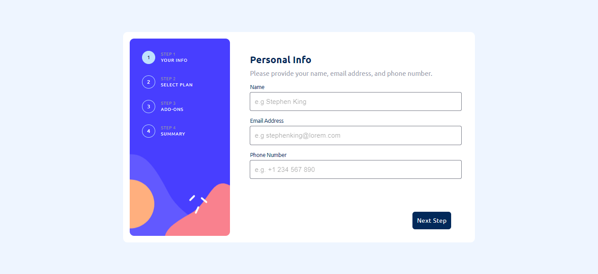
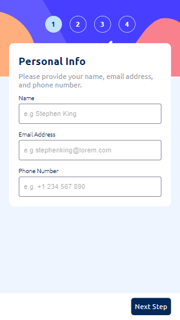

# Frontend Mentor - Multi-step form solution

This is a solution to the [Multi-step form challenge on Frontend Mentor](https://www.frontendmentor.io/challenges/multistep-form-YVAnSdqQBJ). Frontend Mentor challenges help you improve your coding skills by building realistic projects.

## Screenshots

 

## Link

- [Live Site URL](https://multi-step-form-frontendmentor.netlify.app/)

## The challenge

Users should be able to:

- Complete each step of the sequence
- See a summary of their selections on the final step and confirm their order
- View the optimal layout for the interface depending on their device's screen size
- See hover and focus states for all interactive elements on the page

## Built with

- Semantic HTML5 markup
- CSS custom properties
- [Styled Components](https://styled-components.com/)
- [Material UI](https://mui.com/)
- Flexbox
- Mobile-first workflow
- TypeScript
- React

## Author

Chiara Stefanelli - Front-End Development Student based in Italy

- Website - [Chiara Stefanelli](https://chiarastefanelli.netlify.app/)
- LinkedIn - [Chiara Stefanelli](https://www.linkedin.com/in/chiarastefanelli/?locale=en_US)
- Frontend Mentor - [Chiara Stefanelli](https://www.frontendmentor.io/profile/chiarastef)
